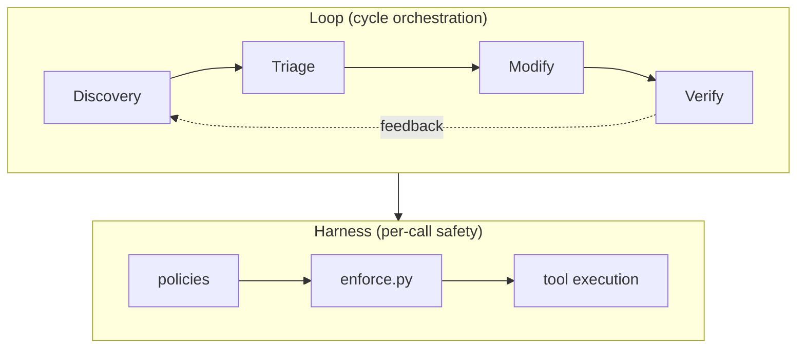

# Loop Engineering — from skills to autonomous feedback loops

> "A skill answers a question. A loop closes it."

[Harness Engineering](./harness-engineering.md) constrains what an agent *can* do.
Loop Engineering defines what an agent *keeps doing* — autonomously, cyclically,
and with explicit feedback edges that turn individual skills into self-correcting
systems.

## Relationship to Harness Engineering

Loop Engineering does not replace the harness — it builds on top of it. It is the
outermost layer in a progression that contains all prior layers:

```
Prompt Engineering (2022–2024)
  └─ Context Engineering (2025)
       └─ Harness Engineering (early 2026)
            └─ Loop Engineering (2026)
```

Each layer wraps and contains the ones before it. You still write prompts, you
still curate context, you still build a harness. Loop engineering is the part
where all of that gets put into motion and given a rhythm — designing a cycle you
trust enough to walk away from.

| Layer | Responsibility | Artifact |
|---|---|---|
| **Prompt** | Wording of individual instructions | Prompts within SKILL.md |
| **Context** | Everything the model sees at inference time | `.omao/` state, ontology, retrieved docs |
| **Harness** | Safety of individual tool calls | `policies`, `enforce.py`, PreToolUse hooks |
| **Loop** | Orchestration of skill sequences into autonomous cycles | `loops:` section in `*.oma.yaml` |



## The Triple Feedback Loop, realized

The [ontology-engineering](./ontology-engineering.md) document defines three nested
loops conceptually. Loop Engineering makes them executable:

| Loop | Cadence | OMA implementation | Skills involved |
|---|---|---|---|
| **Quality Loop** | 1h + event-driven | `loops.quality-loop` | `continuous-eval`, `self-improving-loop`, `autopilot-deploy` |
| **Incident Loop** | event-driven | `loops.incident-loop` | `anomaly-detection`, `root-cause-analysis`, `automated-remediation`, `slo-management` |
| **Cost Loop** | 6h + event-driven | `loops.cost-loop` | `cost-governance`, `anomaly-detection`, `predictive-scaling`, `slo-management` |

## Anatomy of a loop

Every loop follows the same structural pattern:

```
┌─────────────────────────────────────────────────────────┐
│                     LOOP DEFINITION                       │
├──────────┬──────────────────────────────────────────────┤
│ mode     │ continuous (monitoring) or event-driven (goal)│
│ cadence  │ When does the loop tick? (cron/duration)      │
│ trigger  │ What events start it outside cadence?         │
│ steps    │ Ordered skill sequence with dependencies      │
│ feedback │ Explicit edges forming the cycle              │
│ gate     │ Where does a human approve? (severity-based)  │
│ exit     │ When is the loop done? (verifier.passes)      │
│ budget   │ How much can it spend? (tokens/cost/time)     │
│ breaker  │ When does the loop halt itself?               │
│ escalate │ Where does it hand off when stuck?            │
└──────────┴──────────────────────────────────────────────┘
```

### Steps follow Discovery → Triage → Modify → Verify

Each loop's steps map to this 4-phase pattern (based on the "4단계 순환 휠"):

1. **Discovery** — Automation wakes up, checks state files, collects signals
2. **Triage** — Analyzes signals, determines if action is needed. If no actionable items → **skip remaining, idle until next tick**
3. **Modification** — Executes the change in an **isolated worktree** (sub-agent writes code, never in main)
4. **Verification** — Sub-agent reviews, runs checks, creates PR if passing

The **feedback edge** (`verify -> discover`) closes the loop: after verification,
the next discovery cycle begins.

The critical design principle: **"이 단계들 중 어느 것에도 직접 프롬프트를 던지지 않았다."**
(You designed this once. You don't manually prompt any of these stages.)

## Termination model — layered exits

Loop engineering's hardest problem is knowing when to stop. OMA implements
**layered termination** with multiple independent exit paths:

```python
# Pseudocode equivalent of OMA's termination model
state = init_state(goal)

for iteration in range(max_iterations):        # hard cap
    result = run_iteration(state, steps)

    if result.skip_remaining:                  # Triage said "nothing to do"
        sleep_until_next_cadence()
        continue

    state = update(state, result)

    if exit_when_satisfied(state):             # verifier.passes
        return success(state)

    if no_progress(state):                     # same error N times
        return escalate_to_human(state)

    if budget_exhausted(state):                # tokens/cost/time
        return escalate_to_human(state)

return escalate_to_human(state)                # max_iterations exceeded
```

### The 5 exit paths

| Exit path | Trigger | Behavior |
|---|---|---|
| **Normal success** | `exit_when` condition satisfied | Loop returns to idle (continuous) or completes (event-driven) |
| **Early skip** | `skip_remaining_if` on Triage step | This iteration ends early, loop sleeps until next tick — NOT a termination |
| **No progress** | Same state repeated N times | Escalation to human with trace |
| **Budget exhausted** | Token/cost/time limit hit | Escalation with partial progress |
| **Max iterations** | Hard cap reached | Escalation — prevents infinite loops |
| **Circuit breaker** | Consecutive failures | Loop halted, cooldown period, then retry |

### Continuous vs Event-driven

| Aspect | `mode: continuous` | `mode: event-driven` |
|---|---|---|
| Starts | On cadence tick (e.g. every 1h) | On trigger event (alert, signal) |
| "Exit" means | Skip this iteration, sleep until next tick | Loop run is complete, go idle |
| `exit_when` | Pauses until next cadence | Fully terminates the run |
| Typical use | Quality monitoring, cost monitoring | Incident response |
| Never truly stops | Correct — it's a monitoring daemon | Correct — it's a task runner |

### `skip_remaining_if` — the Triage gate

This is the most common "exit" in practice. Most iterations of a continuous loop
find nothing actionable:

```yaml
steps:
  - id: discover
    skill_ref: continuous-eval
    skip_remaining_if: "no_regression_detected"  # ← 90% of iterations end here
  - id: triage
    skill_ref: self-improving-loop
    depends_on: [discover]
    skip_remaining_if: "no_actionable_proposal"  # ← most of the rest end here
  - id: modify
    ...
```

This means the full Modify → Verify cycle only runs when there's genuinely
something to fix. The loop stays cheap and fast in the common case.

## Severity-based gating

The Modify step uses a **severity-based gate** to balance autonomy with safety:

```yaml
gate:
  type: severity-based
  auto_approve_below: medium  # low/medium auto-approve
  timeout_minutes: 30         # wait for human if high/critical
  notify: ["slack:#approvals"]
```

| Severity | Example action | Gate behavior |
|---|---|---|
| **low** | Add index hint to slow query | Auto-approve |
| **medium** | Restart unhealthy pod | Auto-approve (if `auto_approve_below: medium`) |
| **high** | Scale down production fleet | Pause, notify, wait for human |
| **critical** | Modify IAM policy, deploy to prod | Pause, escalate, require explicit approval |

This preserves OMA's Tier-0 approval model: humans retain authority over
high-impact decisions while low-risk operational actions flow automatically.

## Isolation — worktrees for safe modification

The Modification step runs in an **isolated git worktree**, not in the main
working directory. This prevents:

- Collisions between parallel loops modifying the same repo
- Half-finished changes polluting the main branch
- Accidental side effects from failed modifications

```yaml
steps:
  - id: modify
    skill_ref: autopilot-deploy
    isolation: worktree         # creates WORKTREE: ISOLATED-PATCH-{id}
    gate:
      type: severity-based
      auto_approve_below: low
```

The worktree is created as `ISOLATED-PATCH-{loop-id}-{iteration}`, changes are
committed there, and only after Verification passes does a PR get created from
that branch. If Verification fails, the worktree is discarded — no cleanup needed
in main.

## Circuit breaker

Every loop has a circuit breaker to prevent runaway execution:

```yaml
circuit_breaker:
  consecutive_failures: 3    # open after 3 failures
  cooldown_minutes: 120      # stay open for 2 hours
  notify: ["slack:#alerts"]  # alert the team
```

This is the harness pattern "Circuit Breaker" (previously on the roadmap)
realized through loop-level enforcement rather than per-call enforcement.

## DSL syntax

Loops are declared in the `loops:` section of a v2 `*.oma.yaml` file:

```yaml
version: 2
plugin: agenticops

loops:
  quality-loop:
    description: "Continuous quality improvement cycle"
    mode: continuous
    cadence: "1h"
    trigger_on:
      - slo_breach: "faithfulness < 0.82"
      - skill_signal: "continuous-eval.regression"
    exit_when:
      - manual: true
    max_iterations: 20
    budget:
      max_cost_usd: 10.0
      max_wall_clock_minutes: 90
    no_progress_detection:
      repeated_state_count: 3
      action: escalate
    steps:
      - id: discover
        skill_ref: continuous-eval
        skip_remaining_if: "no_regression_detected"
      - id: triage
        skill_ref: self-improving-loop
        depends_on: [discover]
        skip_remaining_if: "no_actionable_proposal"
      - id: modify
        skill_ref: autopilot-deploy
        depends_on: [triage]
        isolation: worktree
        gate:
          type: severity-based
          auto_approve_below: low
      - id: verify
        skill_ref: continuous-eval
        depends_on: [modify]
    feedback:
      - "verify -> discover"
    circuit_breaker:
      consecutive_failures: 3
      cooldown_minutes: 120
    escalation:
      notify: ["slack:#ops-alerts"]
      create_issue: true
```

## Compiler validation

The compiler validates loops at build time:

- Every `skill_ref` must resolve to a skill directory under the plugin's `skills/`
- Every `depends_on` reference must name a step `id` in the same loop
- Every `feedback` edge must reference valid step `id`s in the format `"source -> target"`
- At least one feedback edge must exist (otherwise it's a workflow, not a loop)
- Steps must form a valid DAG (ignoring feedback edges) — no forward cycles within a single iteration

## Loop state

Each loop maintains state in `.omao/state/loops/`:

```
.omao/state/loops/
├── quality-loop.state.json
├── incident-loop.state.json
└── cost-loop.state.json
```

State schema (per loop):

```json
{
  "loop_id": "quality-loop",
  "mode": "continuous",
  "status": "running",
  "current_step": "triage",
  "iteration": 47,
  "last_started": "2026-07-26T10:00:00Z",
  "last_completed": "2026-07-26T09:12:34Z",
  "consecutive_failures": 0,
  "circuit_breaker": "closed",
  "pending_approval": null,
  "budget_consumed": {
    "tokens": 142000,
    "cost_usd": 3.42,
    "wall_clock_minutes": 12
  },
  "no_progress": {
    "last_state_hash": "a3f2c1",
    "repeat_count": 0
  },
  "history": [
    {
      "iteration": 46,
      "started": "2026-07-26T09:00:00Z",
      "completed": "2026-07-26T09:00:34Z",
      "result": "skipped",
      "exit_reason": "skip_remaining_if: no_regression_detected",
      "steps_executed": ["discover"],
      "steps_skipped": ["triage", "modify", "verify"]
    },
    {
      "iteration": 45,
      "started": "2026-07-26T08:00:00Z",
      "completed": "2026-07-26T08:12:34Z",
      "result": "success",
      "exit_reason": "iteration_complete",
      "steps_executed": ["discover", "triage", "modify", "verify"],
      "steps_skipped": []
    }
  ]
}
```

## Loop Controller runtime — decision deferred

The Loop Controller is responsible for executing loops at the defined cadence,
listening for event triggers, managing state transitions, and enforcing circuit
breakers. **The runtime implementation is intentionally deferred** — the loop
definitions (schema, DSL, state) are designed to be runtime-agnostic.

### Options under consideration

| Option | Description | Pros | Cons |
|---|---|---|---|
| **EventBridge + Step Functions** | AWS-native orchestration | Built-in scheduling, event routing, state management, retry logic | AWS dependency, cost, IAM complexity |
| **GitHub Actions (scheduled)** | CI/CD-based execution | Free for public repos, easy setup, git-native | Limited event routing, cold start, 5-min minimum schedule |
| **Local cron + hook** | `.omao/` state file + harness hooks check periodically | Works offline, zero infra, good for dev/demo | Not production-grade, single-machine |
| **Kubernetes CronJob + Argo Workflows** | K8s-native orchestration | Already have EKS infra, powerful DAG engine | Heavy for simple loops, cluster dependency |

### Selection criteria (for future decision)

- **Deployment target**: Personal tool → local cron. Team platform → Step Functions. OSS sample → GitHub Actions.
- **Event richness**: If loops need sub-minute reaction to alerts → EventBridge. If hourly is fine → cron/GHA.
- **State durability**: Production → DynamoDB/S3-backed state. Dev → `.omao/state/` files.
- **Cost**: GitHub Actions is free for public repos. Step Functions bills per state transition.

The key design constraint: **the loop definition in `*.oma.yaml` must not change
regardless of which runtime is chosen.** The controller reads the compiled loop
spec and executes it — the spec is the contract.

## Skill interface contract

Skills participating in a loop declare their inputs and outputs via frontmatter:

```yaml
# In SKILL.md frontmatter
loop-interface:
  accepts-from:
    - continuous-eval.report
    - incident-response.rca
  emits-to:
    - autopilot-deploy.artifact
    - self-improving-loop.proposal
  emits-signals:
    - continuous-eval.regression
    - cost-governance.anomaly
```

This enables the compiler to validate that loop steps are properly connected:
a step's `accepts-from` must include something emitted by at least one of its
`depends_on` predecessors.

## Migration from standalone skills

Existing skills continue to work as standalone invocations. Loop membership is
additive — a skill can participate in a loop AND be invoked independently.

The migration path:

1. Add `loop-interface` frontmatter to skills (non-breaking)
2. Define loops in `*.oma.yaml` referencing existing skills (non-breaking)
3. Deploy a Loop Controller runtime (new infra)
4. Shift from manual invocation to loop-driven execution (operational change)

Steps 1–2 are what this PR delivers. Steps 3–4 are future work.
